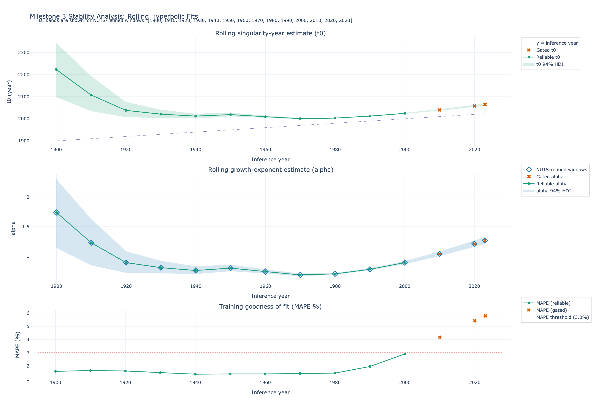

# World Population Singularity Analysis

## Research Question
This project revisits the classic "population singularity" hypothesis and asks:

- Did global population growth historically follow a hyperbolic power-law trend with a finite-time singularity?
- If so, when did the inferred singularity year begin to move or destabilize as new data became available?
- Does rolling Bayesian inference indicate a regime shift away from singular behavior?

In practical terms, we estimate the hyperbolic model

$$
N(t) = \frac{C}{(t_0 - t)^\alpha}
$$

across rolling inference windows and track how the inferred parameters (especially $t_0$) evolve over time.

## Approach Summary
- Data source: Our World in Data (OWID) population series (world aggregate).
- Model: Bayesian hyperbolic growth model with constrained priors.
- Inference protocol: rolling-window estimation over historical cutoffs.
- Diagnostics: training fit quality and reliability gating.
- Visualization: stability dashboard for $t_0$, $\alpha$, and MAPE.

## Stability Analysis Plot
The figure below is the 3-panel Stability Analysis output:

- Top: inferred singularity year $t_0$ over inference windows (with HDI bands).
- Middle: inferred growth exponent $\alpha$ over inference windows (with HDI bands).
- Bottom: training MAPE with gating threshold.

## Repository Contents
- `analysis.ipynb`: full end-to-end notebook implementation.
- `singularity_analysis_spec.md`: original project specification and milestone requirements.
- `stability_analysis.png`: exported Stability Analysis plot used in this README.

## Notes
Recent windows in the rolling analysis show deterioration in training fit (higher MAPE), which is consistent with the hypothesis that global dynamics have shifted away from a stable hyperbolic regime.

### Why the Shift Occurred in the 1980s

The 1980s are widely recognized by demographers as the decade where the "Great Deceleration" became undeniable. While the growth rate (%) actually peaked in the late 1960s (at about 2.1%; see [Our World in Data, "Population growth rate with and without migration"](https://ourworldindata.org/grapher/population-growth-rate-with-and-without-migration?country=~OWID_WRL)), the absolute annual increase in humans didn't peak until the late 1980s.

The shift away from the power law during this decade can be attributed to three massive global "brakes":

**The "Asian Tigers" & China Effect:** In the late 1970s and early 1980s, the most populous regions on Earth underwent a massive cultural shift. China implemented the One-Child Policy in 1979. Simultaneously, "Tiger" economies (South Korea, Taiwan) saw explosive economic growth, which is historically the fastest way to crash a birth rate.

**Contraceptive Prevalence:** The 1980s saw the first generation of globalized access to family planning. In 1960, contraceptive use in the developing world was negligible; by 1990, it had climbed to over 50% in many regions (see [World Bank, "Contraceptive prevalence, any methods (% of women ages 15-49)"](https://data.worldbank.org/indicator/SP.DYN.CONU.ZS) and the underlying UN Population Division estimates). This broke the "superexponential" feedback loop where more people automatically led to more births.

**The Success of the Green Revolution:** This is counter-intuitive, but the Green Revolution of the 1960s and 1970s prevented the Malthusian collapses predicted in the 1960s. Instead of people dying (which would have kept the population low), people survived, moved to cities, and became educated. Urbanization is the ultimate "singularity killer"—once a family moves from a farm to a city apartment, a child shifts from being a "producer" (free labor) to a "consumer" (an expense), and birth rates drop naturally.

### The "Phase Change"

The data effectively captures a **Phase Change**. Von Foerster's model assumed humans would continue to "eliminate environmental barriers" through cooperation forever. He didn't account for the fact that as we conquered the environment, we would also change our own biological behavior (the Demographic Transition).

In physics terms, the 1980s was the point where the system's **negative feedback loops** (education, urbanization, contraception) finally overcame the **positive feedback loops** (medical advancement, food production) that were driving the singularity.